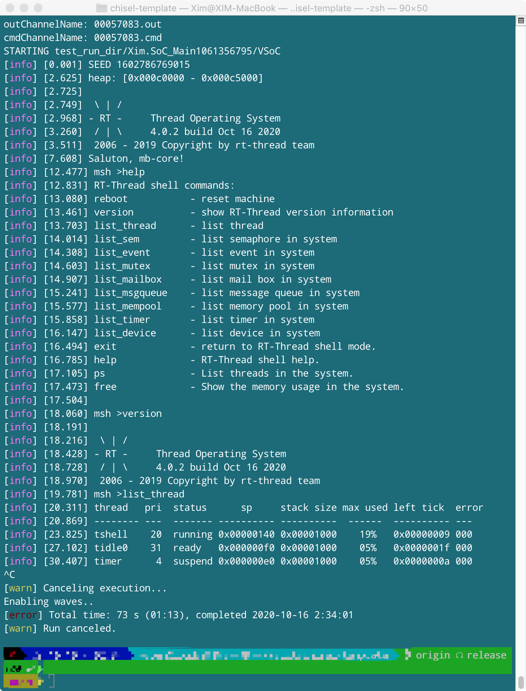

# 一生一芯计划

MB estas mia blato en Esperanto

MB is short for my chip in Esperanto

## 目标

使用chisel实现一支持risc-v 64 IMZicsr指令集的CPU，支持异常和Machine态，可运行RT-Thread系统。

### 当前目标

考虑到当前时间有限，经调研，启动RT-Thread最少需求为risc-v 32 IZicsr并支持异常和Machine态。

## 整体结构

当前设计为二级流水线（取指&执行）。

### 当前设计

IF级发出指令请求后等待握手，等待请求握手完成后完成数据握手，方可进入下一流水级。
EX级进行指令译码执行访存写回，若为访存指令则发出访存请求，请求握手完成后完成数据握手。注意一旦进入就可计算出分支发生与否及相应地址。若发生分支跳转则前递给上一流水级，提供下一pc值并设置本级reload信号，使得下一指令不产生实际效果。

## 进度日志：

### Finished

2020.9.22 第一条指令(addi x1, zero, 100)

2020.9.24 分支指令（beq zero, zero, 0x10）

2020.9.26 AXI RAM接入，构建简易SoC

2020.10.2 CSR指令接入

2020.10.3 开跑部分功能测试

2020.10.6 增加risc-v test自动测试脚本，确认全部RV32I指令跑通

2020.10.15 RT-Thread不开中断跑通

2020.10.16 RT-Thread带异常情形跑通

### TODO

1. 分支预测器
2. 测试框架进一步完善

**Note that any branch other than `release` is not stable, functions may break without warning.**

## 运行RT-Thread

### 前期准备

使用[RTT for mb-core](https://github.com/chenguokai/rtt-mbcore/tree/master/bsp/mb-core) 处源码编译生成rtthread.elf，后使用[tests](https://github.com/chenguokai/mbcore-tests) 处脚本31.rtt.sh处理ELF格式文件生成可供AXI RAM加载的bin文件，然后调整仿真用AXI RAM的bin文件加载路径即可。

### 运行

推荐使用sbt工具调用SoC_Main中Type_Three的方法运行。该情形下i变量循环次数即为期待测试指令数。

## 测试框架实现细节

> 注意当前源码内一些硬编码路径可能需要根据本机实际情况做调整

### Type 1: any predicatable benchmark test

程序正常执行甚至发生预期的异常时，几乎不会出现前后两条指令PC值一致的情形，如此一来判定指令前进变得异常简单，只需以相邻周期PC值是否有所改变作为新指令到来判据。
使用[isa_sim](https://github.com/ultraembedded/riscv/tree/master/isa_sim)
所提供的ISA模拟器，可导出benchmark执行trace，与上述指令判断依据结合即可实现指令比对。

### Type 2: risc-v test related auto test

所有risc-v 官方ISA测试集均在pass/fail时调用ecall指令，而在其余位置不出现ecall，且pass向a0寄存器写0，fail向a0寄存器写1。可由此借助auto_test.py实现自动化测试。

### Type 3: any test without test feedback

Type 1无需进行trace比较的变种，往往用于带有时钟中断的较复杂系统测试。

## 生成verilog

每一非BlackBox组件内均含object，可直接生成对应组件的verilog源码。